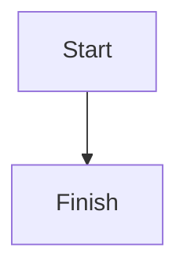
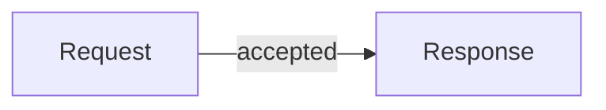
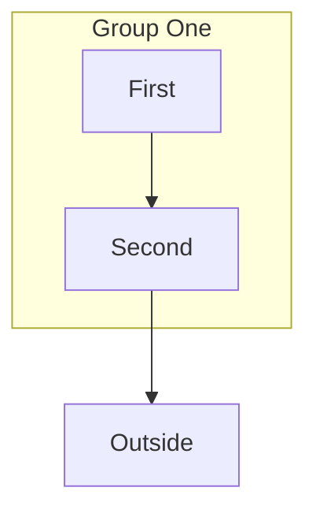
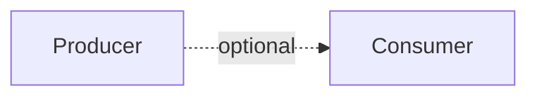
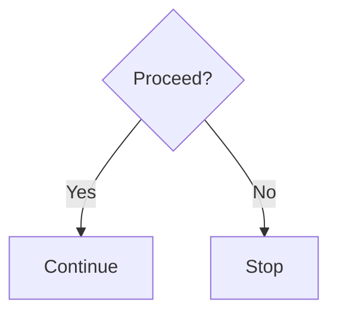
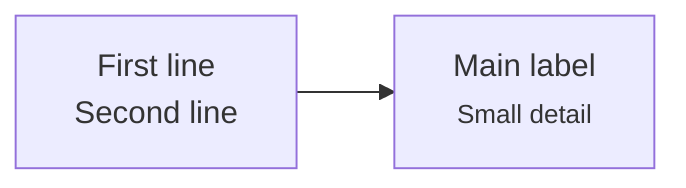
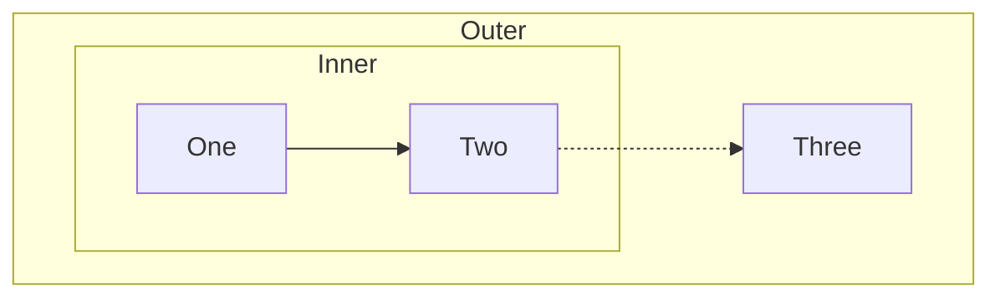
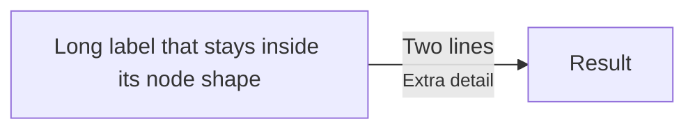
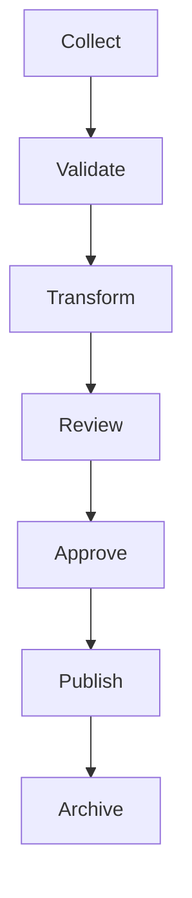
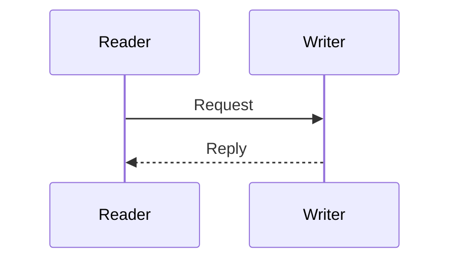

# Diagram examples

## Example 1

## Example 2

## Example 3

## Example 4

## Example 5

## Example 6

## Example 7

## Example 8

## Example 9

## Example 10

~~~{#relationships .mermaid}
erDiagram
  PERSON ||--o{ DOCUMENT : authors
  DOCUMENT ||--|{ SECTION : contains
  PERSON {
    int id PK
    string name
  }
  DOCUMENT {
    int id PK
    string title
  }
  SECTION {
    int number
    string heading
  }
~~~

## Example 11

